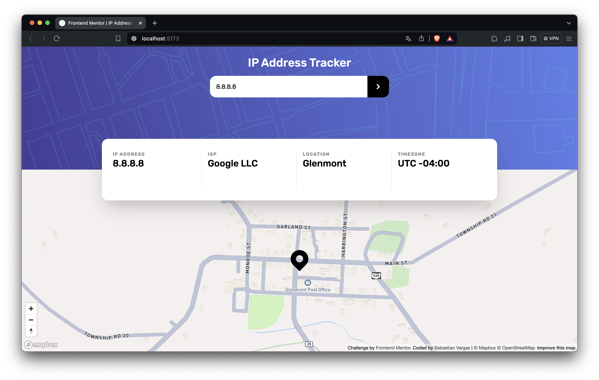
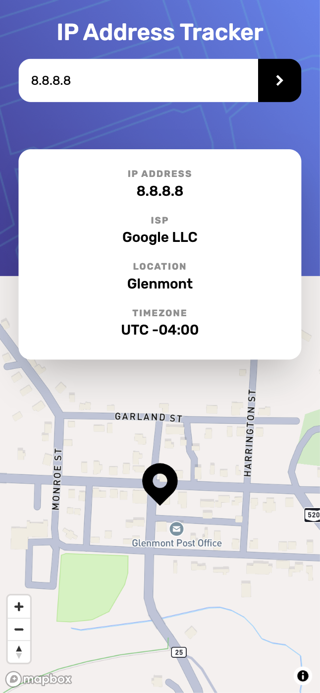
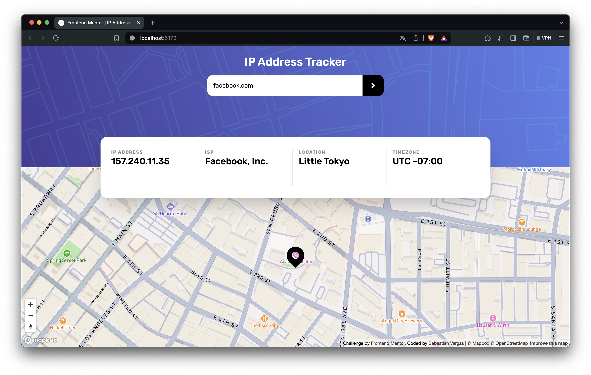
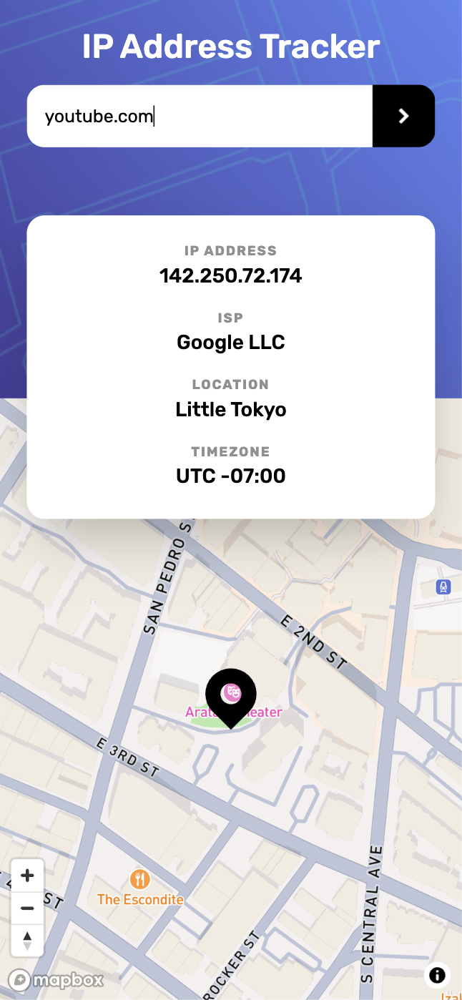

# Frontend Mentor - IP address tracker solution

This is a solution to the [IP address tracker challenge on Frontend Mentor](https://www.frontendmentor.io/challenges/ip-address-tracker-I8-0yYAH0).

## Table of contents

- [Overview](#overview)
  - [The challenge](#the-challenge)
  - [Screenshots](#screenshots)
  - [Links](#links)
- [My process](#my-process)
  - [Built with](#built-with)
  - [What I learned](#what-i-learned)
  - [Continued development](#continued-development)
  - [Useful resources](#useful-resources)
- [Author](#author)

**Note: Delete this note and update the table of contents based on what sections you keep.**

## Overview

### The challenge

Users should be able to:

- View the optimal layout for each page depending on their device's screen size
- See hover states for all interactive elements on the page
- See their own IP address on the map on the initial page load
- Search for any IP addresses or domains and see the key information and location

### Screenshots

| | Desktop | Mobile | 
| -- | -- | -- |
| IP |  |  |
| Domain name |  |  |

### Links

- Solution URL: [IP Tracker Solution](https://www.frontendmentor.io/solutions/ip-tracker-app-using-react-ts-and-vite-zVJyKq-AVr)
- Live Site URL: [TCOTD's IP Tracker](https://tcotd-ip-tracker-fm.netlify.app/)

## My process

### Built with

- Semantic HTML5 markup
- Mobile-first workflow
- [Vite](https://vitejs.dev/)
- [React](https://reactjs.org/) - To render the UI
- [TailwindCSS](https://tailwindcss.com/) - For styles

### What I learned

In this project, I have proposed to use a Clean Architecture approach. I have learned the basic concepts to create an application using this architecture, separating it under the respective layers.
Despite being a small project for this type of architectures, since it is my first approach to this type of design, I think it has been, at least, a good start.

### Continued development

I would like to reinforce my Clean Architecture concepts to better apply them in future projects I create. What I found a bit difficult -at least at first- was trying to implement the Repository pattern correctly. Also, how the layers are connected to each other.

### Useful resources

- [(Spanish) Improve your code with Clean Architecture](https://www.youtube.com/watch?v=bdnpXzgj1oY&t=522s&pp=ygUbY2xlYW4gYXJjaGl0ZWN0dXJlIGZyb250ZW5k) - This video helped me to start with a basic concept of how I would start coding the project.
- [Clean Architecture on Frontend](https://bespoyasov.me/blog/clean-architecture-on-frontend/) - This is a very comprehensive article about how could you implement Clean Architecture with Frontend considerations.

## Author

- Website - [My GitHub](https://github.com/sebas-tcotd)
- Frontend Mentor - [@sebas-tcotd](https://www.frontendmentor.io/profile/sebas-tcotd)
- Twitter - [@sebas_tcotd](https://twitter.com/sebas_tcotd)
